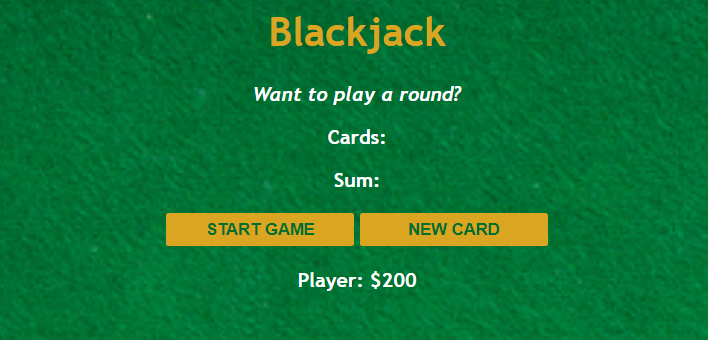

# Blackjack Game

This project is a simple Blackjack game built using HTML, CSS, and JavaScript. The game allows players to simulate a round of Blackjack, drawing cards and calculating their sum to try to reach 21 without going over.

## Features

- **Start Game**: Begin a new round of Blackjack.
- **Draw New Card**: Draw an additional card to add to your hand.
- **Display**: Shows the cards drawn and their current sum.

## How to Play

1. **Start Game**: Click the "START GAME" button to begin a new round.
2. **Draw Card**: Click the "NEW CARD" button to draw a new card and add it to your hand.
3. **Win or Lose**: Try to reach a sum of 21 without going over.

## Try It Live

You can try the Blackjack game live at the following link:

[Try It Live](https://66817954c64fca10f9727a8a--stellar-cassata-f46d6e.netlify.app/)

## Screenshot

## License

This project is licensed under the MIT License.
