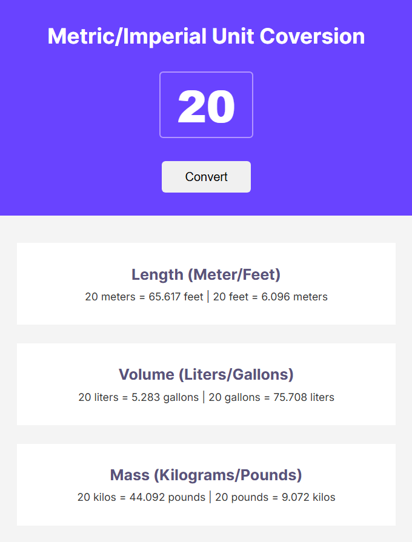

# Unit Converter

This project is a simple Unit Converter built using HTML, CSS, and JavaScript. The converter allows users to convert between different units of measurement, such as length, volume, and weight. Additionally, this project can be used as a Chrome extension.

## Features

- **Length Conversion**: Convert between meters and feet.
- **Volume Conversion**: Convert between liters and gallons.
- **Weight Conversion**: Convert between kilograms and pounds.
- **Chrome Extension**: Can be used as a Chrome extension for quick access.

## How to Use

1. **Enter Value**: Input the value you want to convert in the provided input field.
2. **Convert**: Click the "Convert" button to see the conversion results.
3. **View Results**: The converted values will be displayed below the input field.

## How to Use as a Chrome Extension

1. **Download As a Folder**: Download all these file and place in a new directory.
2. **Load Extension**: Open Chrome and go to `location of your created directory`. Enable "Developer mode" and click "Load unpacked". Select the project directory.
3. **Use Extension**: The Unit Converter will be available as a Chrome extension for quick access.

## Try It Live

You can try the Unit Converter live at the following link:

[Try It Live](https://euphonious-tapioca-ab3068.netlify.app/)

## Screenshots

## License

This project is licensed under the MIT License.
